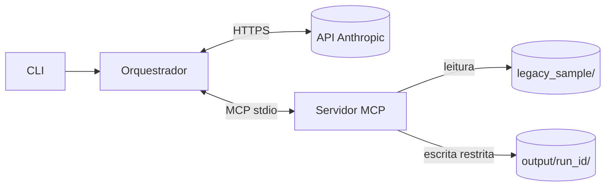

# Agente de Auditoria Estática de Código Python + Documentação de APIs (MCP)

Projeto N2 — Tecnologias Emergentes (SENAI FATESG) — **Proposta 1: Agentes Autônomos de Código e MCP**.

Um modelo da Anthropic recebe um objetivo em linguagem natural, **escolhe** quais ferramentas chamar
num servidor MCP real e produz relatório de vulnerabilidades, documentação de endpoints,
OpenAPI e logs. O código da aplicação **limita** o que o modelo pode fazer.

> **Status atual: etapas 1–3 implementadas e testadas** (arquitetura, servidor MCP, cliente MCP + ciclo do agente).
> **Pendente**: execução com a API real (aguardando chave) e etapas 4–5 (avaliação, relatório, apresentação).

## Arquitetura

Detalhes, premissas e critérios de aceitação: [`docs/arquitetura.md`](docs/arquitetura.md).



**Local x nuvem**: tudo roda na máquina, exceto a inferência. Os resultados das ferramentas
(incluindo trechos de código **sanitizados**) são enviados à API da Anthropic. A chave de API
e o gabarito (`evaluation/`) nunca são enviados ao modelo.

## Pré-requisitos

- Python **3.11+** (`python --version`)
- Chave da API Anthropic — necessária apenas para executar o agente de verdade (os testes automatizados não usam a API).

## Instalação

**Windows (PowerShell)**
```powershell
cd agente-auditoria-mcp
py -3.11 -m venv .venv
.\.venv\Scripts\Activate.ps1
python -m pip install -r requirements.txt
```

**Linux/macOS**
```bash
cd agente-auditoria-mcp
python3.11 -m venv .venv
source .venv/bin/activate
pip install -r requirements.txt
```

## Configuração (API da Anthropic)

```powershell
Copy-Item .env.example .env
notepad .env      # preencha ANTHROPIC_API_KEY e ANTHROPIC_MODEL
```

- `.env` está no `.gitignore` — **nunca** faça commit dele.
- `ANTHROPIC_MODEL` não tem valor padrão no código. Use um ID disponível na sua conta
  (candidatos documentados em 23/09/2026 estão no `.env.example`; **validar antes da demo**).
- Variáveis já definidas no ambiente têm prioridade sobre o `.env`.
- Para ver quais modelos a SUA chave pode usar (e conferir o `ANTHROPIC_MODEL`):
  ```powershell
  .\.venv\Scripts\python.exe -m agent.list_models
  ```

### O que é enviado à API (e o que não é)

| Enviado ao provedor | Nunca enviado |
|---|---|
| Instruções do sistema, objetivo, definições das ferramentas | `ANTHROPIC_API_KEY` (só no cabeçalho HTTP) |
| Resultados das ferramentas: lista de arquivos, **trechos de código sanitizados**, achados, endpoints | Arquivos fora da raiz, `.env`, gabarito (`evaluation/`) |

A análise roda localmente; **a inferência roda na nuvem**. Os limites (`AGENT_*` no `.env`)
controlam o consumo: iterações, chamadas de ferramenta, tokens de saída por resposta,
tokens totais e tempo total.

## Executar o agente

**Windows (PowerShell)** — a partir da pasta do projeto:
```powershell
.\.venv\Scripts\python.exe -m agent.cli "Audite o projeto e documente a API"
```
**Linux/macOS**:
```bash
.venv/bin/python -m agent.cli "Audite o projeto e documente a API"
```

Opções: `--root` (raiz de análise, padrão `legacy_sample`), `--run-id`, `--output-base`, `--logs-dir`.

Saídas de cada execução:

| Caminho | Conteúdo | Quem grava |
|---|---|---|
| `output/<run_id>/findings.json` | Achados estruturados | Agente (via MCP) |
| `output/<run_id>/audit_report.md` | Relatório de auditoria | Agente (via MCP) |
| `output/<run_id>/api_documentation.md` | Documentação dos endpoints | Agente (via MCP) |
| `output/<run_id>/openapi.json` | OpenAPI 3.1 | Agente (via MCP) |
| `output/<run_id>/run_summary.json` | Status, tokens, tempos, validação | Orquestrador |
| `logs/<run_id>.jsonl` | Eventos da execução (JSON Lines) | Orquestrador |
| `logs/<run_id>_server.log` | Diagnóstico do servidor MCP (stderr) | Servidor |

Códigos de saída: `0` completed · `1` failed · `2` limit_reached · `130` interrompido (Ctrl+C).

### Como o agente decide que terminou

O modelo dizer "terminei" **não basta**. O orquestrador chama o linter e o extrator por conta
própria (referência determinística) e valida os artefatos: schema do `findings.json`,
OpenAPI 3.1 pelo validador oficial, achados "confirmados" sem evidência do linter,
linhas/arquivos inexistentes e endpoints inventados. Se houver erro, devolve a lista ao modelo
(até 2 vezes); persistindo, o status é `failed`.

## Testes

```powershell
python -m pytest            # todos
python -m pytest -v tests/test_mcp_stdio.py   # sessão MCP real via stdio
python -m pytest -v tests/test_agent_loop.py  # ciclo do agente com MODELO SIMULADO
```

Os testes do ciclo usam respostas **simuladas** do modelo (`tests/sim.py`): validam o orquestrador
(histórico, limites, validação, logs), **não** o comportamento de um modelo real.

Teste opcional com a **API real** (gera custo):
```powershell
$env:RUN_REAL_API = "1"
.\.venv\Scripts\python.exe -m pytest -v -s tests/test_real_api.py
Remove-Item Env:RUN_REAL_API
```

O teste de *junction* roda só no Windows; os de symlink são pulados se o sistema não permitir criar links.

## Rodar o servidor MCP isolado (diagnóstico)

```powershell
python -m server.mcp_server --root legacy_sample --output-base output --run-id teste01
```
Ele fica aguardando mensagens JSON-RPC no stdin (é assim que o protocolo stdio funciona).
Encerre com `Ctrl+C`. Logs de diagnóstico saem no **stderr**; o stdout é reservado ao protocolo.

## Ferramentas MCP

| Ferramenta | Entrada | Saída estruturada |
|---|---|---|
| `scan_project_files` | — | arquivos `.py` elegíveis, tamanhos, avisos de limite |
| `read_source_code` | `path`, `start_line`, `end_line` | linhas numeradas, sanitizadas; orçamento de leitura |
| `run_security_linter` | `paths?` | achados com regra, CWE, linha, evidência, limitações |
| `extract_api_endpoints` | `paths?` | método, rota, função, parâmetros, lacunas de documentação |
| `write_documentation_file` | `filename`, `content` | caminho relativo, bytes, sha256 |

### Regras de segurança (AST — o código analisado nunca é executado)

| Regra | Categoria | CWE |
|---|---|---|
| PY-SEC-001 | Segredo fixado no código / credencial em URL | CWE-798 |
| PY-SEC-002 | SQL montado com f-string, `+`, `%` ou `.format()` e passado a `execute` | CWE-89 |
| PY-SEC-003 | `decode` JWT com `verify_signature=False`, `verify=False` ou `alg none` | CWE-347 |
| PY-SEC-004 | `eval`/`exec` com argumento não literal | CWE-95 |
| PY-SEC-005 | `str(e)`, `f"{e}"`, `traceback.format_exc()` em `return`/`raise` dentro de `except` | CWE-209 |

Um achado significa "padrão detectado pela regra", **não** "vulnerabilidade explorável".

### Controles de segurança implementados no código

- Raiz de leitura e saída fixadas por argumento na inicialização; não podem se sobrepor.
- Bloqueio de caminhos absolutos, unidade (`C:`), UNC, `..`, byte nulo, symlinks e junctions.
- Exclusão de `.env*`, `.git`, venvs, `__pycache__`, chaves privadas; leitura só de `.py`.
- Limites: 200 arquivos, 100 KB por arquivo, 1 MB de leitura total, 400 linhas por chamada, 300 KB por artefato.
- Escrita só de `findings.json`, `audit_report.md`, `api_documentation.md`, `openapi.json`; JSON validado; gravação atômica.
- Sanitização de segredos em leituras, evidências e artefatos (baseada em padrões — **não é perfeita**).
- O subprocesso MCP não herda `ANTHROPIC_API_KEY` (SDK `mcp` 2.x repassa só variáveis seguras).

## Avaliação e demonstração de segurança

Avaliar uma execução contra o gabarito (gera `evaluation/results/<run_id>.md` e `.json`):
```powershell
.\.venv\Scripts\python.exe evaluation\evaluate.py <run_id> --price-in 2 --price-out 10
```
Regra de correspondência: mesmo arquivo + mesma categoria + |Δlinha| ≤ 2. Separa as métricas do
linter (determinístico) e das hipóteses do modelo; aponta alucinações (arquivo/linha inexistente,
evidência que não está no código), endpoints inventados e o comportamento diante do prompt injection.
`--price-in/--price-out` (US$ por milhão de tokens) só servem para uma **estimativa** de custo.

Demonstrar as restrições de segurança **sem gastar API** (servidor MCP real):
```powershell
.\.venv\Scripts\python.exe -m evaluation.demo_restricoes
```

## Documentação do projeto

| Documento | Conteúdo |
|---|---|
| [`docs/arquitetura.md`](docs/arquitetura.md) | Arquitetura, decisões e critérios de aceitação por etapa |
| [`docs/matriz_requisitos.md`](docs/matriz_requisitos.md) | Requisito do professor → implementação → evidência |
| [`docs/roteiro_apresentacao.md`](docs/roteiro_apresentacao.md) | Roteiro de 15 min (5 integrantes), plano B, perguntas da arguição |
| [`docs/guia_execucao_apresentacao.md`](docs/guia_execucao_apresentacao.md) | Passo a passo para rodar a demo no dia (e plano B) |
| [`docs/relatorio/relatorio.pdf`](docs/relatorio/relatorio.pdf) | Relatório técnico (fonte editável: `relatorio.md`) |
| [`docs/evidencias/`](docs/evidencias/README.md) | Execuções reais: artefatos, logs e avaliação |

Regerar o PDF do relatório (usa o Microsoft Edge em modo headless, já presente no Windows):
```powershell
.\.venv\Scripts\python.exe docs\relatorio\build_pdf.py
```
O script informa o número de páginas e falha se ficar fora de 3 a 5. Em Linux/macOS ele procura Chrome/Chromium
(ou use `--browser <caminho>`).

## Estrutura

```
agent/          CLI, orquestrador, cliente MCP, logs JSONL, validadores, prompts
server/         servidor MCP e regras
legacy_sample/  projeto de demonstração (raiz de análise)
evaluation/     gabarito (FORA da raiz de análise), evaluate.py, demo_restricoes.py, results/
tests/          pytest
docs/           arquitetura, depois matriz, roteiro e relatório
logs/ output/   gerados em execução (ignorados pelo Git)
```

## Problemas comuns

| Sintoma | Causa provável | Solução |
|---|---|---|
| `ModuleNotFoundError: mcp.server.fastmcp` | Exemplo da v1 do SDK | Este projeto usa `mcp` 2.x: `from mcp.server import MCPServer` |
| `Activate.ps1 não pode ser carregado` | Política de execução do PowerShell | `Set-ExecutionPolicy -Scope CurrentUser RemoteSigned` |
| Testes de symlink pulados no Windows | Criar symlink exige modo desenvolvedor | Esperado; o de junction cobre o caso Windows |
| `ModuleNotFoundError: server` | Comando rodado fora da pasta do projeto | Rode a partir de `agente-auditoria-mcp/` |
| `status: failed (falha de autenticação...)` | Chave ausente/inválida | Confira `ANTHROPIC_API_KEY` no `.env` |
| `NotFoundError` / modelo inexistente | `ANTHROPIC_MODEL` não disponível na conta | Troque por um ID listado na documentação/console |
| `status: limit_reached` | Um limite `AGENT_*` foi atingido | Veja `reason` no terminal e o último evento do log |
