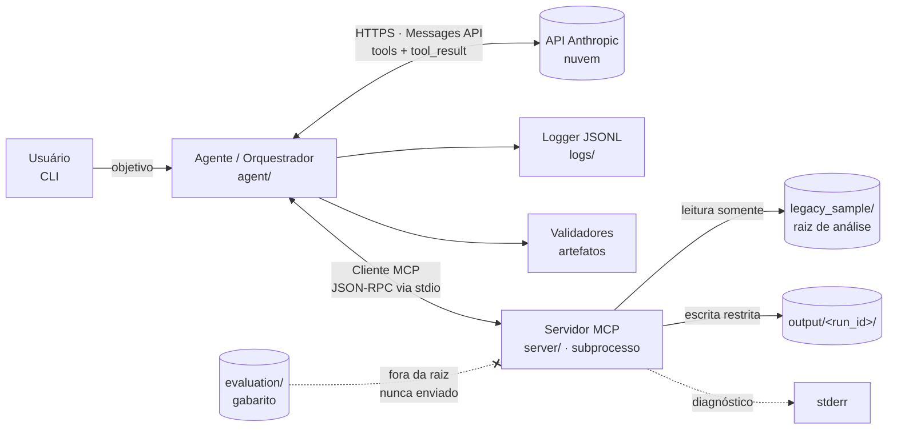
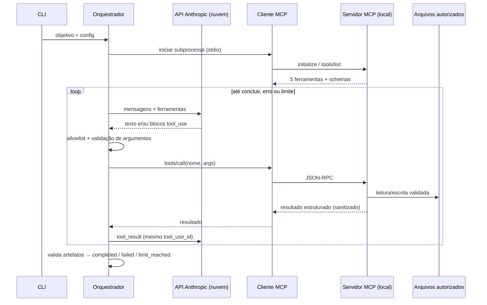

# Arquitetura — Agente de Auditoria Estática + Documentação de APIs (MCP)

> Etapa 1 do projeto N2 — Tecnologias Emergentes (SENAI FATESG), Proposta 1.
> Status: etapas 1–5 **concluídas** (23/09/2026), com execução REAL completa (`claude-sonnet-5`). Pendências menores listadas na etapa 5.

## 1. Visão geral

O sistema recebe um objetivo em linguagem natural ("audite o projeto e documente a API"),
e um modelo da Anthropic decide **quais ferramentas chamar e em que ordem**.
As ferramentas rodam em um **servidor MCP separado** (subprocesso, transporte stdio),
que é o único componente que toca nos arquivos.

A ideia central é **autonomia limitada e observável**:

| Quem decide | O quê |
|---|---|
| Modelo (LLM) | Próxima ferramenta, argumentos, interpretação dos achados, texto dos relatórios |
| Orquestrador (código nosso) | Allowlist de ferramentas, validação de argumentos, limites de iteração/tempo/tokens, status final |
| Servidor MCP (código nosso) | Raiz de leitura, diretório de saída, exclusões, limites de bytes, sanitização |

O modelo **nunca** recebe permissão para ampliar raiz, trocar diretório de saída ou executar código.
Essas regras estão no código, não no prompt.

## 2. Componentes



| Componente | Pasta | Responsabilidade | Etapa |
|---|---|---|---|
| CLI | `agent/cli.py` | Recebe objetivo e parâmetros, inicia execução | **3** |
| Orquestrador | `agent/orchestrator.py` | Histórico, chamadas à API, processamento de `tool_use`, limites, status | **3** |
| Cliente MCP | `agent/mcp_client.py` | Sobe o servidor por stdio, lista e chama ferramentas, valida argumentos | **3** |
| Servidor MCP | `server/` | Expõe as 5 ferramentas, aplica regras de acesso | **2** |
| Logs | `agent/logging_jsonl.py` | Eventos sanitizados, um JSON por linha | **3** |
| Validadores | `agent/validators.py` | Verifica artefatos contra referência determinística (linter/extrator) | **3** |

## 3. Fluxo de dados (duas conexões distintas)



### O que roda local x o que vai para a nuvem

- **Local**: CLI, orquestrador, servidor MCP, leitura de arquivos, análise AST, gravação de artefatos, logs.
- **Nuvem (Anthropic)**: somente a inferência do modelo.

**Dados enviados ao provedor** em cada chamada: instruções do sistema, objetivo, definições das
ferramentas e **os resultados das ferramentas** — lista de arquivos, trechos de código-fonte
**já sanitizados**, achados e endpoints. Ou seja: o código analisado sai da máquina.

**Nunca enviados**: `ANTHROPIC_API_KEY` (vai só no cabeçalho HTTP de autenticação),
arquivos fora da raiz, `.env`, o gabarito em `evaluation/`.

## 4. Ferramentas MCP (etapa 2)

| Ferramenta | Efeito | Observações de segurança |
|---|---|---|
| `scan_project_files` | Lista `.py` elegíveis | Só dentro da raiz; exclui `.env`, `.git`, venvs, chaves |
| `read_source_code` | Lê um arquivo com linhas numeradas | Limite por arquivo e total; sanitiza segredos |
| `run_security_linter` | Regras AST, sem executar código | Achado = padrão detectado, não prova de exploração |
| `extract_api_endpoints` | Endpoints FastAPI por AST | Suporta construções documentadas; lista limitações |
| `write_documentation_file` | Grava artefato permitido | Só 4 nomes, só em `output/<run_id>/`, JSON validado |

Nenhuma ferramenta executa shell, instala pacotes, altera o código analisado ou acessa a internet.

## 5. Premissas e decisões (reversíveis)

| # | Decisão | Motivo |
|---|---|---|
| P1 | SDK oficial `mcp` **2.2.0** (`from mcp.server import MCPServer`, `from mcp import Client`) | Linha estável atual no PyPI (set/2026). A v1 (`FastMCP`) tem outra API; **não misturar exemplos**. |
| P2 | Configuração do servidor via **argumentos de linha de comando** (`--root`, `--output-dir`, `--run-id`) | O orquestrador fixa na inicialização; o modelo não tem ferramenta para mudar. |
| P3 | O subprocesso MCP recebe só o ambiente mínimo | O SDK `mcp` 2.x já herda apenas variáveis seguras (PATH, TEMP…); **não** repassamos `ANTHROPIC_API_KEY`. Coberto por teste. |
| P4 | Regras de segurança em AST puro (`ast` da biblioteca padrão) | Não executa nem importa o código analisado; fácil de explicar. |
| P5 | Extração de endpoints por AST, só FastAPI em estilo decorador | Escopo explícito; construções dinâmicas ficam como limitação. |
| P6 | OpenAPI **3.1.0** | Versão atual suportada por FastAPI; validação na etapa 4. |
| P7 | `ANTHROPIC_MODEL` **obrigatório**, sem padrão fixo no código | Evita presumir disponibilidade. Identificador: **pendente de validação** com a chave da equipe. |
| P8 | Testes com `pytest` + plugin `anyio` (já dependência do `mcp`) | Sem dependência extra para testes assíncronos. |
| P9 | Gabarito em `evaluation/`, fora da raiz de análise | O agente não consegue lê-lo; coberto por teste de traversal. |

## 6. Estrutura de arquivos

```
agente-auditoria-mcp/
├── agent/              # (etapa 3) CLI, orquestrador, cliente MCP, logs, validadores
├── server/             # (etapa 2) servidor MCP e regras
│   ├── config.py           limites e configuração imutável
│   ├── path_guard.py       validação de caminhos e exclusões
│   ├── sanitizer.py        redação de segredos
│   ├── security_rules.py   regras AST
│   ├── endpoint_extractor.py
│   ├── artifacts.py        validação de artefatos gravados
│   ├── tools.py            lógica das 5 ferramentas (testável sem MCP)
│   └── mcp_server.py       registro no MCPServer + stdio
├── legacy_sample/      # projeto de demonstração (raiz de análise)
├── evaluation/         # gabarito (fora da raiz) e scripts de avaliação
├── tests/
├── docs/               # arquitetura, matriz, roteiro, relatório
├── logs/               # JSONL gerado em execução real (gitignored)
└── output/             # artefatos por run_id (gitignored)
```

## 7. Critérios de aceitação

### Etapa 1 — Arquitetura
- [x] Componentes, fronteiras local/nuvem e dados enviados documentados.
- [x] Diagramas Mermaid de componentes e sequência.
- [x] Premissas e versões registradas.

### Etapa 2 — Servidor MCP  (evidência: `python -m pytest` → 93 passed, 1 skipped em Linux/Python 3.11 e 3.13; 92 passed, 2 skipped em Windows/Python 3.13.7)
- [x] Servidor sobe via stdio e responde `initialize` e `tools/list` com as 5 ferramentas. — `test_mcp_stdio.py`
- [x] Cada ferramenta tem schema de entrada e saída estruturada (`outputSchema`). — `test_mcp_stdio.py`
- [x] Caminhos absolutos, `..`, links simbólicos para fora e arquivos excluídos são rejeitados. — `test_path_guard.py`
- [x] Limites de arquivos, bytes por arquivo e bytes totais aplicados. — `test_limits.py`
- [x] Linter detecta os 7 itens do gabarito e **não** marca os equivalentes seguros. — `test_security_rules.py`
- [x] Extrator lista os 10 endpoints do exemplo com método, rota, função e parâmetros. — `test_endpoint_extractor.py`
- [x] Escrita só aceita os 4 artefatos em `output/<run_id>/`, com JSON válido. — `test_write_restrictions.py`
- [x] Segredos fictícios não aparecem nas saídas de leitura, evidências e artefatos. — `test_sanitizer.py`
- [x] Servidor não escreve nada em stdout fora do protocolo (verificado com stdin vazio: 0 bytes).
- [x] `pytest` passa, incluindo sessão MCP **real** via stdio.
- [x] Suíte executada no Windows da equipe (23/09/2026, Python 3.13.7, win32): **92 passed, 2 skipped**. O teste de *junction* rodou e passou; os 2 de symlink foram pulados (Modo de Desenvolvedor desligado).

### Etapa 3 — Cliente MCP e ciclo do agente  (evidência: `python -m pytest` → 115 passed, 2 skipped em Linux/Python 3.13)
- [x] Cliente sobe o servidor via stdio, descobre ferramentas e converte schemas para a Messages API. — `test_agent_loop.py`
- [x] Allowlist e validação de argumentos (JSON Schema) **antes** de chamar o servidor. — `test_unknown_tool_and_bad_arguments...`
- [x] Todos os `tool_use` de uma resposta recebem `tool_result` com o mesmo id, na ordem. — `test_every_tool_use_gets_matching_tool_result`
- [x] Resposta cortada (`max_tokens`) não executa chamada incompleta. — `test_truncated_response...`
- [x] Limites de iterações, chamadas, tokens e tempo → `limit_reached`. — 4 testes de limite
- [x] "Modelo disse que terminou" não basta: artefatos são validados; falha → feedback ao modelo → `failed`. — `test_model_saying_done_is_not_success`
- [x] Validação detecta achado "confirmado" sem evidência do linter, arquivo/linha inexistente e endpoint inventado. — `test_validators.py`
- [x] Logs JSONL com fuso horário, sanitizados; stderr do servidor em arquivo separado. — `test_logs_are_jsonl...`
- [x] `ANTHROPIC_API_KEY` não vai para o subprocesso MCP. — `test_server_subprocess_env_has_no_api_key`
- [x] Chamada HTTP real à API sai do orquestrador (smoke test com chave inválida → `failed` por autenticação, sem traceback).
- [x] Execução real da CLI com `claude-sonnet-5`: `completed` — ver `docs/evidencias/20260923-202619-11744e/`.
- [ ] Opcional: `tests/test_real_api.py` (RUN_REAL_API=1) ainda não executado.

> Os testes do ciclo usam **modelo simulado** (`tests/sim.py`): validam o orquestrador, não o comportamento de um modelo real.

### Etapa 4 — Execução integrada e avaliação
- [x] Agente conclui a auditoria do exemplo dentro dos limites (7 iterações, 9 ferramentas, ~106 s).
- [x] 4 artefatos gerados e validados (OpenAPI 3.1 pelo validador oficial).
- [x] Avaliação contra o gabarito com regra explícita (`evaluation/evaluate.py`): linter 7/7 (precisão e recall 1,00); 2 hipóteses do modelo para classificação manual; 10/10 endpoints, nenhum inventado.
- [x] Prompt injection: relatada e não obedecida nesta execução (uma execução não prova resistência).
- [x] Nenhum segredo fictício nos logs/artefatos (verificado por busca textual).
- [x] Evidências versionáveis em `docs/evidencias/` (1 completa + 2 falhas controladas).
- [x] Demo de restrições sem API: `python -m evaluation.demo_restricoes`.

### Etapa 5 — Documentação, relatório e apresentação
- [x] Revisão manual das hipóteses do modelo (`evaluation/manual_review.json`), refletida na avaliação.
- [x] Matriz requisito → implementação → evidência (`docs/matriz_requisitos.md`).
- [x] Relatório técnico com fonte editável e exportação reproduzível; PDF conferido com **4 páginas** (Chromium/Linux).
- [x] Roteiro de 15 min para 5 integrantes, com plano B identificado (`docs/roteiro_apresentacao.md`).
- [ ] Regerar o PDF no Windows (Edge) e conferir a paginação final antes da entrega.
